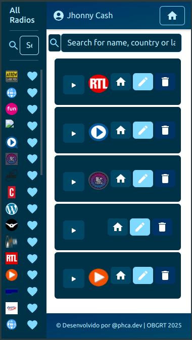

# Radio App 📻
 Este projeto é uma aplicação front-end desenvolvida por mim, Pedro Henrique Coli Andrade, como parte de um desafio técnico para testar habilidades em estruturação, tomada de decisões e desenvolvimento de soluções escaláveis utilizando React.js no processo seletivo da empresa ForPeople Fábrica de Softwares. O objetivo é criar uma plataforma onde os usuários possam explorar, ouvir e gerenciar suas rádios favoritas, consumindo uma API de rádios.

## Descrição

A aplicação permite que os usuários:

- Adicionem rádios à sua lista de favoritos.

- Visualizem, editem e removam rádios da lista.

- Ouçam e parem a transmissão de rádios diretamente na plataforma.

- Pesquisem rádios por nome, país ou idioma.

- Tenham suas listas de rádios salvas para acesso futuro.

Além disso, o projeto inclui funcionalidades extras, como testes unitários, configuração Docker para facilitar o deploy e publicação em uma plataforma de hospedagem.

## Tecnologias Utilizadas

- **Linguagem**: TypeScript
- **Framework**: React.js
- **Bibliotecas**:
  - React Router DOM (para roteamento)
  - Axios (para requisições HTTP)
  - Zustand (para gerenciamento de estado)
  - Material-UI (para componentes de UI)
  - Vite (para build e desenvolvimento)
- **Testes**:
  - Vitest (para testes unitários)
  - Testing Library (para testes de componentes)
- **Ferramentas**:
  - Docker (para containerização)
  - ESLint e Prettier (para linting e formatação de código)

## Como Instalar e Usar o Projeto

### Pré-requisitos

- Node.js (versão 18 ou superior)
- Docker (opcional, para rodar em contêiner)

### Passos para Instalação
1. Clone o repositório (Com uma chave SSH):
   ```bash
   git clone git@github.com:dropeko/forpeople-frontend-test.git
   cd forpeople-frontend-test
2. Instale as dependências:
   ```bash
   npm install
3. Inicie o servidor de desenvolvimento:
   ```bash
   npm run dev
4. Abra o navegador e acesse  para visualizar a aplicação:
   ```bash
   http://localhost:5173

### Rodando com Docker
1. Construa a imagem Docker:
   ```bash
   docker-compose build
2. Inicie o contêiner Docker:
   ```bash
   docker-compose up
3. Acesse a aplicação em:
   ```bash
   http://localhost:3000

### Executando Testes
1. Para executar os testes unitários:
   ```bash
   npm run test
2. Para verificar a cobertura de testes:
   ```bash
   npm run coverage

## Funcionalidades Obrigatórias

- **Adicionar rádio à lista:** Os usuários podem adicionar rádios à sua lista de favoritos.
- **Visualizar lista de rádios:** Os usuários podem ver todas as rádios adicionadas.
- **Remover rádio:** Os usuários podem remover rádios da lista.
- **Editar informações da rádio:** Os usuários podem editar detalhes das rádios salvas.
- **Ouvir rádio:** Os usuários podem reproduzir a transmissão de uma rádio.
- **Parar rádio:** Os usuários podem parar a reprodução.
- **Pesquisar rádio:** Os usuários podem buscar rádios por nome, país ou idioma.
- **Paginação:** A lista de rádios é exibida com paginação.
- **Persistência de dados:** As rádios favoritas são salvas e persistem mesmo após o usuário sair da aplicação.

## Funcionalidades Extras

- **Testes Unitários:** Foram implementados testes unitários utilizando Vitest e Testing Library.
- **Docker:** O projeto foi containerizado para facilitar o deploy e a execução em diferentes ambientes.
- **Publicação:** A aplicação foi publicada na Vercel e pode ser acessada online.

## Link de Apresentação

A aplicação está **disponível** online no seguinte link:
[Old But Gold Radio Tune](https://old-gold-radio.vercel.app/)

## Considerações Finais

Este projeto foi desenvolvido como parte de um desafio técnico proposto pela ForPeople. O objetivo foi demonstrar habilidades em desenvolvimento front-end, tomada de decisões técnicas e implementação de funcionalidades escaláveis.

**This is a challenge by [Coodesh](https://coodesh.com/).**

---

## Preview:
- Desktop view:


- Mobile view:

   

---
Made with 💙 by **@phca.dev**

